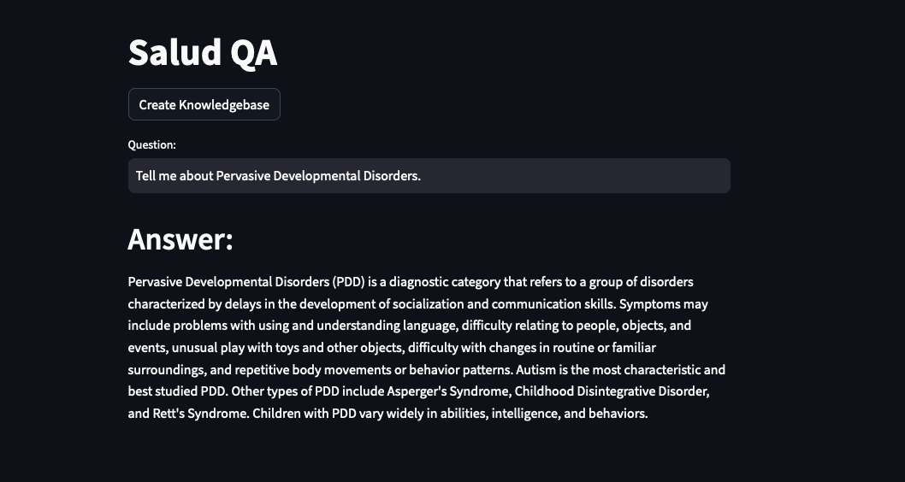

# Salud Q&A Project

The Medical Q&A Project is a language-based exploration tool designed to enhance healthcare information retrieval and question-answering. Leveraging cutting-edge technologies, the project integrates Langchain and Google's Gemini Pro Large Language Models (LLMs) to provide accurate and context-aware answers to medical queries. The user-friendly interface is built using Streamlit, allowing users to interact seamlessly with the system. Text embeddings are powered by Hugging Face's instructor embeddings, ensuring a robust understanding of medical content. The underlying vector database is managed by Chroma, facilitating efficient retrieval and storage of medical information. This project aims to simplify medical information access, making it an invaluable tool for healthcare professionals and enthusiasts alike.




## Tech Stack
  - Langchain + Google Gemini Pro: LLM based Q&A
  - Streamlit: UI
  - Huggingface instructor embeddings: Text embeddings
  - Chroma: Vector databse

## Installation

1.Clone this repository to your local machine using:

```bash
  git clone https://github.com/SumeetChougule/SaludQA.git
```
2.Navigate to the project directory:

```bash
  cd LLM_HealthTech
```
3. Install the required dependencies using pip:

```bash
  pip install -r requirements.txt
```
4.Acquire an api key through makersuite.google.com and put it in .env file

```bash
  GOOGLE_API_KEY="your_api_key_here"
```
## Usage

1. Run the Streamlit app by executing:
```bash
streamlit run main.py

```

2.The web app will open in your browser.


- Now you are ready to ask questions. Type your question in Question box and hit Enter


## Project Structure

- main.py: The main Streamlit application script.
- langchain_helper.py: This has all the langchain code
- requirements.txt: A list of required Python packages for the project.
- .env: Configuration file for storing your Google API key.